# 网络安全技术实验报告——<br>基于 RSA 算法自动分配密钥的加密聊天程序

学  院		网安学院

年  级		大三

班  级		信息安全单学位班 

学  号	 	1811494

姓  名		刘旭萌

手机号		17320205058


## 一、实验目的

在讨论了传统的对称加密算法 DES 原理与实现技术的基础上，本章将以典型的非对称密 码体系中 RSA 算法为例，以基于 TCP 协议的聊天程序加密为任务，系统地进行非对称密码体 系 RSA 算法原理与应用编程技术的讨论和训练。通过练习达到以下的训练目的：

① 加深对 RSA 算法基本工作原理的理解。

② 掌握基于 RSA 算法的保密通信系统的基本设计方法。 

③ 掌握在 Linux 操作系统实现 RSA 算法的基本编程方法。 

④ 了解 Linux 操作系统异步 IO 接口的基本工作原理。 

本章编程训练的要求如下。 

① 要求在 Linux 操作系统中完成基于 RSA 算法的自动分配密钥加密聊天程序的编写。

② 应用程序保持第三章“基于 DES 加密的 TCP 通信”中示例程序的全部功能，并在此 基础上进行扩展，实现密钥自动生成，并基于 RSA 算法进行密钥共享。

③ 要求程序实现全双工通信，并且加密过程对用户完全透明

## 二、实验内容

本章训练要求读者在第三章“基于 DES 加密的 TCP 通信”的基础上进行二次开发，使原 有的程序可以实现全自动生成 DES 密钥以及基于 RSA 算法的密钥分配。

(1) 要求在 Linux 操作系统中完成基于 RSA 算法的保密通信程序的编写。

(2) 程序必须包含 DES 密钥自动生成、RSA 密钥分配以及 DES 加密通讯三个部分。

(3) 要求程序实现全双工通信，并且加密过程对用户完全透明。

(4) 用能力的同学可以使用select模型或者异步IO模型对“基于DES加密的TCP通信” 一章中 socket 通讯部分代码进行优化

## 三、实验步骤及实验结果

### DES加密解密

复用作业“基于DES加密的TCP聊天”中的代码，加解密过程在上一次报告中已经详述。这里只给出大致流程。

#### 加密大致流程

**（解密流程相似，只是密钥使用顺序相反）**

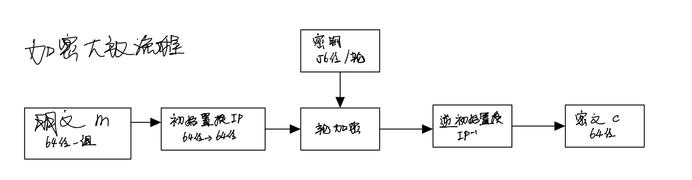

#### 密钥生成

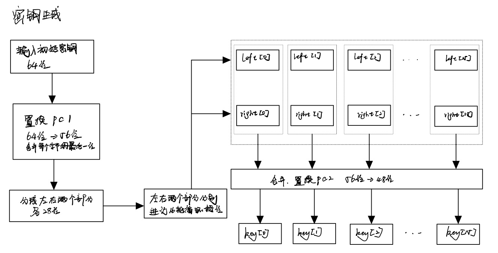

#### 轮加密


### RSA加密解密

大素数生成（512位）

**原理：**

1. **线性同余算法生成随机数**

   - 该算法产生的是伪随机数，只具有统计意义上的随机性，**易被攻破**，不宜在现实情况中使用
   - 参数：
     - 模数：$m(m>0)$，为使随机数的周期尽可能大，m应尽量大，本次实验取$m=2^{31}-1$
     - 乘数：$a(0\leq a<m)$，是m的原根，$eg. a=7^5=16807$
     - 增量：$c$（本次实验中取0）
     - 初值种子：$X_0$，随机选取一32位整数，
   - 随机数序列：$X_{n+1}=(aX_n+c)\bmod n$

2. **Rabin-Miller素数概率检测算法**

   - 定理1：如果$p$为大于2的素数，则方程$x^2\equiv 1(\bmod p)$的解只有$x\equiv 1$ 和 $x \equiv -1$

   - 定理2：若$n$为素数，则$a^{n-1}\equiv1 \bmod n$

   - 每轮检测的伪代码：

     ```C
     witness(a,n){
         d=1;//d初值为1
         for i=k downto 0 do{
             x=d;
             d=(d^2) % n;
             if(d==1&&x!=1&&x!=n-1)//若为素数，x不可能不是1或n-1
                 return FALSE;
             if (n-1的2^i位为1)//
                 d=(d*a) % n;
         }
         if(d!=1)return FALSE;//定理2
         return TRUE;
     }
     ```

   - 该算法为概率性检测，若进行s轮检测，则是素数的概率至少为$1-2^{-s}$
   
3. **Eratosthenes筛素数**

**程序框图：**

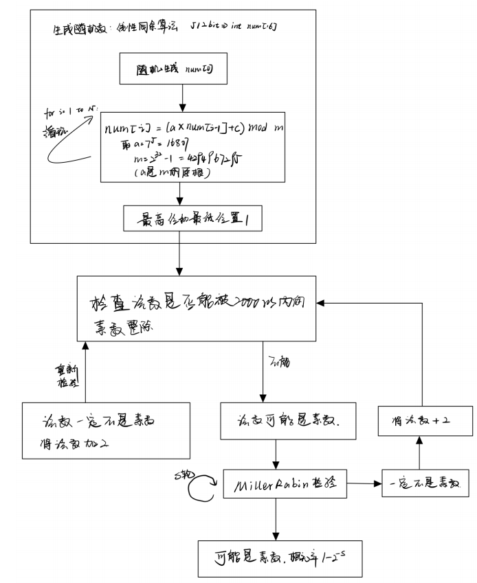


**构建n的长度为1024比特的RSA算法，并利用该算法实现对明文的加密和解密。**

**程序框图**

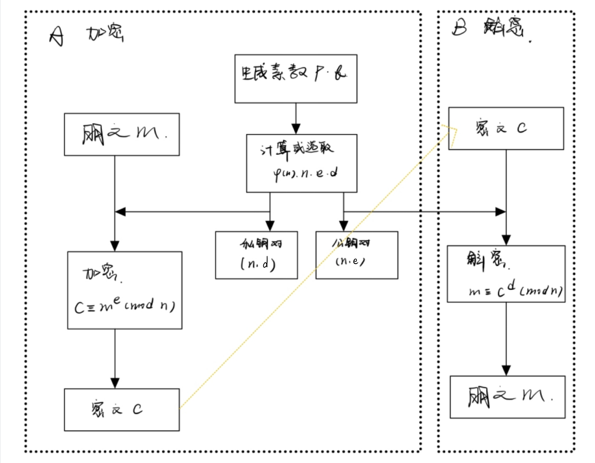

1. 生成密钥对

   ```C++
   RSA_::RSA_(big p, big q,big e)
   {
   	big v1;
   	v1.set(1);
   
   	this->p = p;
   	this->q = q;
   	this->e = e;
   
   	n = mul(p, q);//n=pq
   	big p1, q1;
   	p1 = sub(p, v1);//p-1
   	q1 = sub(q, v1);//q-1
   
   	phi = mul(p1, q1);//phi=(p-1)(q-1)
   	d = getinv(phi, e);//逆元
   }
   ```

2. 加密

   ```C++
   RSAen_::RSAen_(RSA_ a, big m)
   {
   	this->n = a.n;
   	this->e = a.e;
   	this->m = m;
   
   	c = pow(m, e, n);//m^e mod n
   }
   ```

3. 解密

   ```C++
   RSAde_::RSAde_(RSA_ a, big c)
   {
   	this->n = a.n;
   	this->d = a.d;
   	this->c = c;
   
   	m = pow(c, d, n);//c^d mod n
   }
   ```


### TCP通信

#### 通信模型图

本次实验为了满足**多对多通信**，采用**C/S**模型进行设计，利用**server**对消息进行==**转发**==以实现**多个client端**之间的通信


服务器当接收到client[i]想要转发给client[j]的加密消息时，**先用deskey[i]进行解密，在用deskey[j]进行加密**，并将密文转发至client[j]


#### TCP通信原理

与上一个作业大致相似，但略有不同，这里将省略相同部分

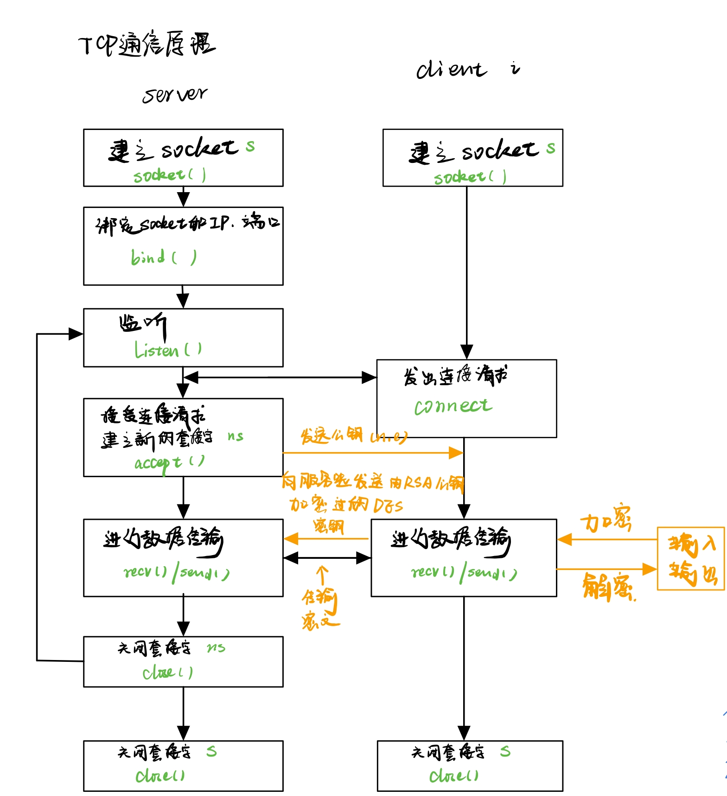

#### 代码

server生成公钥和私钥

```C++
cout << "是否使用默认密钥对？1是 2否" << endl;
	int flag;
	cin >> flag;
	prime p, q;
	if (flag == 1)
	{//事先生成好的素数
p.set("d0af256c8c72facbc0051054813505a340f899bcb05f4dfb83f2a9a4d14eabd312daa80c24bd772b37fe7cf4a39b8803c37a905cab66365b1721ca4400005a49");
	q.set("a698494d2c26ca02ebf5284584c6224ab88e46bd27242f12dfec9cb577df385a3878a22d32aa06224e724f25ce93e06a96691b9d56d08f321733ff9500005d11");
	}
	else if(flag==2)
	{//也可以重新生成
		p.getprime();
		q.getprime();
	}
	cout << "p= "; p.number.print();
	cout << "q= "; q.number.print();
	cout << "开始生成密钥对" << endl;
	RSA_ rsa(p.number, q.number, e);
	cout << "n= "; rsa.n.print();
	cout << "d= "; rsa.d.print();
	cout << "e= "; rsa.e.print();
	cout << "密钥对已生成" << endl;
```

client接收server发来的**公钥**

```C++
//接收n
memset(recvBuf, 0, sizeof(recvBuf));
recv(sockClient, recvBuf, 1024, 0);
n.stringtonum(recvBuf);
//接收e
memset(recvBuf, 0, sizeof(recvBuf));
recv(sockClient, recvBuf, 1024, 0);
e.stringtonum(recvBuf);
```

client对生成的**des密钥进行rsa加密**，并进行发送

```C++
RSA_ secretkey(n, e);
rsa_en_text(mtext, ciphertext, secretkey);
send(sockClient, ciphertext, 512, 0);
```

server接收client发来的连接请求，并解密**获得**对应的**DES密钥**

```C++
for (int i = 0; i < CLIENTNUM; i++)
{
    listen(sockSer, 5);
    sockConn[i] = accept(sockSer, (SOCKADDR*)&addrCli, &len);//失败sockConn=INVALID_SOCKET
    if (sockConn[i] != INVALID_SOCKET)
    {
        cond++;//人数加一
        string buf = "你的id是：";

        buf += 48 + i;//简化，最多九个人

        send(sockConn[i], buf.data(), 50, 0);

        char buf_[1024] = {};
        rsa.n.numtostring(buf_);
        send(sockConn[i], buf_,1024, 0);//发送n
        memset(buf_,1024, 0);
        e.numtostring(buf_);
        send(sockConn[i], buf_, 512, 0);

        //接收加密后的密钥
        memset(buf_, 0, sizeof(buf_));
        while (1)
        {
            recv(sockConn[i], buf_, 1024, 0);
            //对密钥进行解密
            if (buf_[0])
            {
                char* mtext = new char[512];
                rsa_de_text(mtext, buf_, rsa);
                cout << "DES密钥为";//为了方便观察，打印
                memset(deskey[i], 0, 8);
                for (int j = 0; j < 8; j++)
                {
                    deskey[i][j] += mtext[j * 2];
                    deskey[i][j] += mtext[j * 2 + 1] * 16;
                    cout << hex << (int)deskey[i][j]<<" ";
                }
                cout << endl;
                //事先生成加密和解密每一轮所需的密钥，防止重复计算
                getkeys((u_char*)deskey[i], deskey_final[i].key_final);
                for (int k = 0; k < 16; k++)
                    for (int j = 0; j < 6; j++)
                        deskey_final[i].key_final_[15 - k][j] = deskey_final[i].key_final[k][j];
                break;
            }
        }
		//处理完成标志
        cout << "clients " << i << " have connected" << endl;
    }
```

server**转发**接收到的**消息**

```C++
msg_form m = string_to_msg(recvBuf);//解析报文格式
int id = m.to_name - 48;

msg_form tmp;
char buf[BUF_SIZE] = {};
//使用source方的密钥解密
msg_de(m.msg, deskey_final[(int)lparam].key_final_, buf);
cout << buf << endl;
//使用destination方的密钥加密
msg_en(buf, deskey_final[id].key_final, tmp.msg);
//封装报文
tmp.from_name = m.from_name;
tmp.to_name = m.to_name;
//发送消息
send(sockConn[id], (const char*)&tmp, 2048, 0);
```


### 运行截图

**注：为了方便观察，将加密相关信息打印，实际使用时应对用户透明**

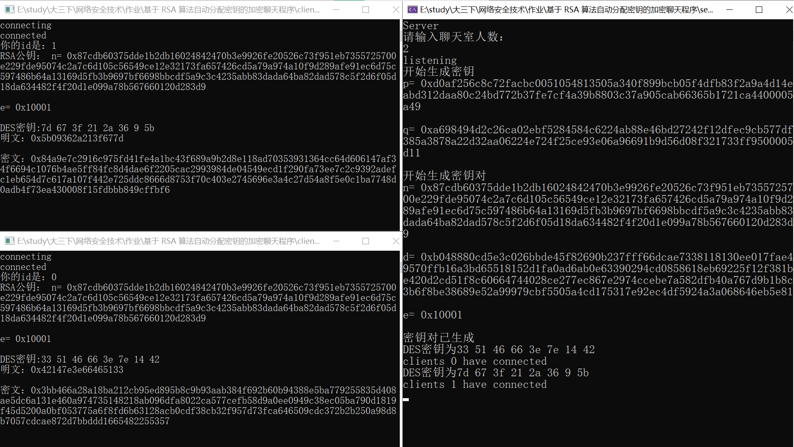


通信过程样例：

1. 生成大素数

   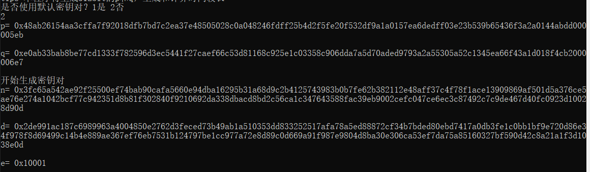

2. 输入**目的clientid和消息内容**，消息内容可以为中文和英文

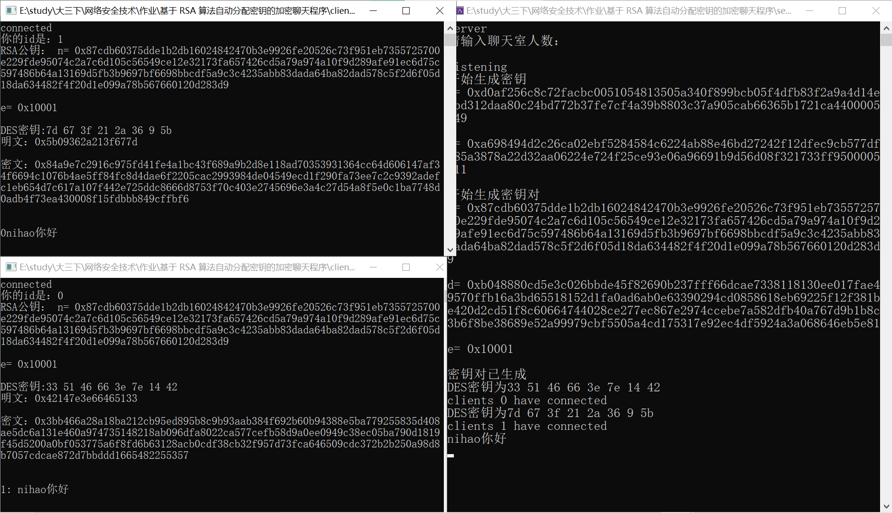


​	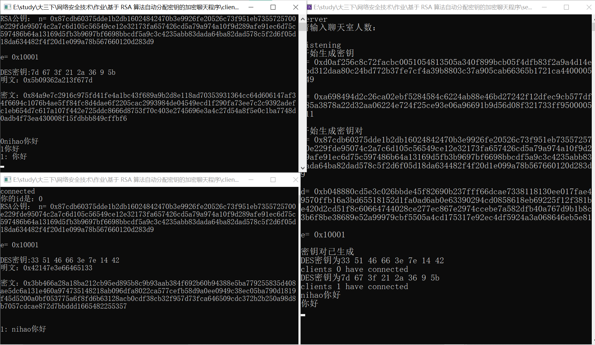

发送长消息示例

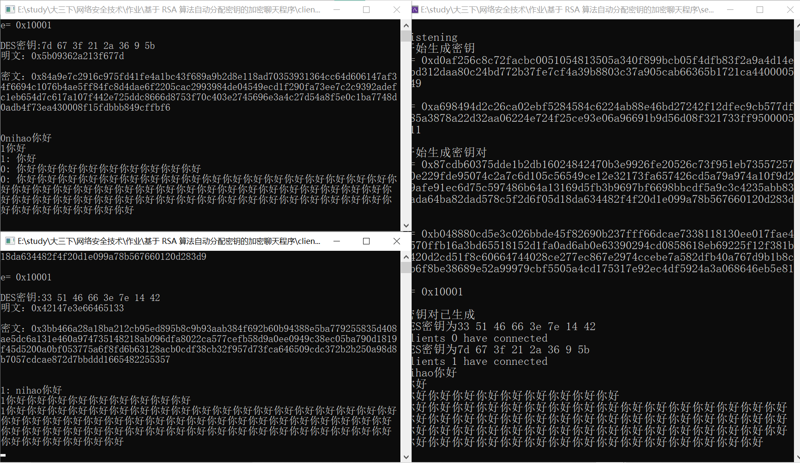

##### 程序的退出

client端输入`quit`，向server发送quit消息后主动退出

server端收到client发送的`quit`指令判断该client退出，当所有client都断开连接时退出程序，关闭socket

```C++
if (!strcmp(m.msg, "quit"))
{
    cout << "用户" << (int)lparam << "退出聊天" << endl;
    cond--; if (!cond)return 0;
}
```

关闭socket

```C++
closesocket(sockSer);
WSACleanup();
```

例如，

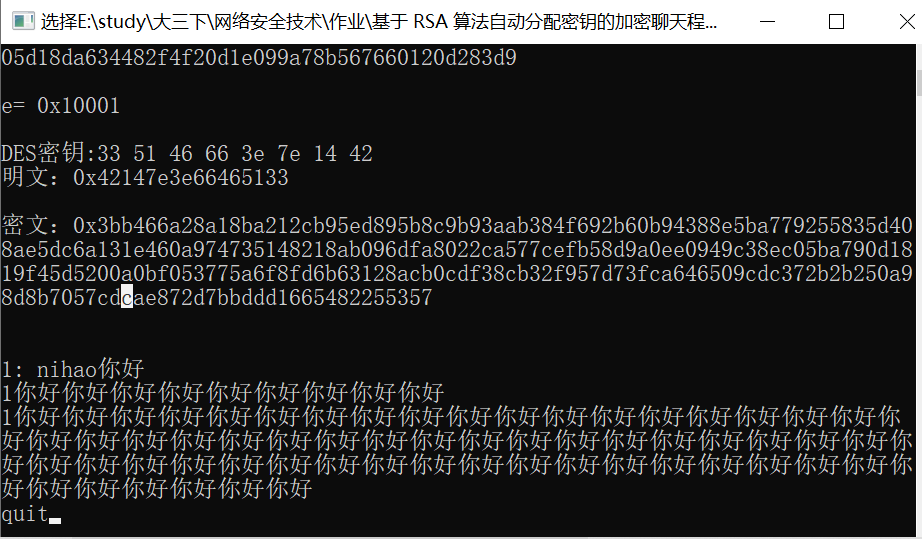

1. client1发送`quit`,发送后客户端退出，server显示该用户断开连接

2. client0发送`quit`，所有连接断开，server退出

   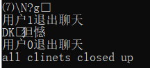


## 四、实验遇到的问题及其解决方法

1. 栈的使用超过限制

   调整VisualStudio中对于栈大小的限制

2. 使用int[16]代表512位整数导致计算非常复杂，且经常由于溢出导致错误

   改为每个int代表4位整数，但是这样可能导致空间占用大，但是程序更加简便，编程难度大大降低

3. 加解密结果不正确

   1. 可能是缓冲区接收数据前没有置零
   2. 数据传输补全
   3. 报文格式解析不正确

## 五、实验结论

- 细致地学习了RSA加解密的各个细节


## 附录：大整数运算

```C++
class big//十六进制
{
public:
	int num[512];//使用数组保存大整数，每一个元素都代表原数的4个bit，即16进制
	big();//初始化全零
	void copy(big);//复制另一个大整数的值
	void print();
	void set(unsigned int a);
	void set(int a);//赋值为a如 set(1)
	void set(string a);//set(0xa)
	void set(string a, int x);//set("Hi"),每个字母对应数组中的两个元素
	void set(unsigned long long a);
	int getbit(int i);//第2^i位是即，如i=0是零次项位
};
big add(big a, big b);
big sub(big a, big b);
big sub(big a, big b, int d);//偏移，a-b*16^4
int compare(big a, big b,int d);//
int compare(big a, big b);
big mul(big a, big b);
big mod(big a, big b);
big pow(big a, big b,big n);//a^b mod n
big getinv(big a, big b);
big div(big a, big b,big &c);//返回商，r是余数
```

- 加法减法和乘法类似，这里只详细解释较为复杂的乘法

    ```C++
    big mul(big a, big b)
    {
        big c;
        for (int i = 0; i < 256; i++)
        {
            for (int j = 0; j < 256; j++)
            {
                c.num[i + j] += a.num[i] * b.num[j];//每个元素都是int类型，a.num[i]和b.num[j]最大为15，不会溢出
            }
        }
        for (int i = 0; i < 510; i++)
        {
            c.num[i + 1] += c.num[i] / 16;//进位运算
            c.num[i] %= 16;
        }
        return c;
    }
    ```

- 取模和除法类似，这里解释除法

    ```C++
    big div(big a, big b, big& c)
    {
        big q;
        int t = compare(a, b);
        if (t == -1)return q;
        if (t == 0)
        {
            big c;
            c.set(1);
            return c;//0
        }
        int x, y;//x,y是a、b的最高位
        for (x = 511; x >= 0; x--)
            if (a.num[x])
                break;
        for (y = 511; y >= 0; y--)
            if (b.num[y])
                break;
        int d = x - y;

        c.copy(a);//c=a
        while (d >= 0)//c的位数大于等于b
        {
            while (c.num[x] > b.num[y])//如果c的最高位大于b的最高位，则c一定大于b
            {
                c = sub(c, b, d);//c-=b*16^d
                big v1;
                v1.num[d]=1;
                q=add(q,v1);//商在对应为上加1
            }
            if (c.num[x] == b.num[y] && compare(c, b, d) == 1)//处理最高位相等情况
            {//compare返回1表示c>b*16^d
                c = sub(c, b, d);
                big v1;
                v1.num[d] = 1;
                q = add(q, v1);
            }
            //此时c<b*16^d
            d--;
            int t;
            while (compare(c, b) == 1 && c.num[x])//借高位余数
            {
                c = sub(c, b, d);
                big v1;
                v1.num[d] = 1;
                q = add(q, v1);
            }
            if (c.num[x] == 0)x--;
            t = compare(c, b);
            if (t == -1)break;//c<b
            if (t == 0)//相等，返回0
            {
                c = sub(c, b);
                big v1;
                v1.num[d] = 1;
                q = add(q, v1);
                return q;
            }
        }
        return q;//商
    }
    ```

- 快速幂，复杂度 O(lgN)

  由于数值过大，不能使用常规求幂方法

  例如，求$0x123^{0x256} \bmod n$

  $0x256=2 \times 16^2+5\times16^1+6\times16^0$

  即$0x123^{0x256}=0x123^{2\times16^2+5\times16^1+6\times16^0}=0x123^{2\times16^2}\times 0x123^{5\times16^1}\times 0x123^{6\times 16^0} $

  所以我们可以先计算出$0x123^{16^0}$、$0x123^{16^1}$和$0x123^{16^2}$

  而$0x123^{16^{i+1}}$=$(0x123^{16^i})^{16}$，此处也应用快速幂计算，即以此计算出2次幂、4次幂、8次幂、16次幂

  ```C++
  
  big pow(big a, big b, big n)//a^b mod n
  {
  	big buffer[512];
  	buffer[0].copy(a);
  	int x;
  	for (x = 511; x > 0; x--)
  		if (b.num[x])
  			break;
  	for (int i = 1; i <= x; i++)
  	{//双层快速幂算法求a**（b**i）
  		big tempbuf[5];
  		tempbuf[0].copy(buffer[i - 1]);
  		for (int j = 1; j < 5; j++)
  		{
  			big temp = mul(tempbuf[j - 1], tempbuf[j - 1]);
  			tempbuf[j] = mod(temp, n);
  		}
  		buffer[i].copy(tempbuf[4]);
  	}
  
  	big product;
  	product.num[0] = 1;
  
  	for (int i = 511; i >= 0; i--)
  	{//a**（k*（b**i））
  		big temp;
  		for(int j=0;j<b.num[i];j++)
  		{
  			temp=mul(product, buffer[i]);
  			product=mod(temp,n);
  		}
  	}
  
  	return product;
  }
  ```
  
- 扩展欧几里得算法求逆元

    ```C++
    big getinv(big a, big b) //a mod b
    {
    	b = mod(b, a);
    	big q[100], t[100],r[100];
    	r[0].copy(a);
    	r[1].copy(b);
    	t[0].set(0);
    	t[1].set(1);//赋初值
    	int i;
    	big v1;
    	v1.set(1);
    	for(i=2;i<500;i++)
    	{
    		q[i - 1] = div(r[i - 2], r[i - 1], r[i]);
    		big temp = mul(q[i - 1], t[i - 1]);
    		while (compare(temp, t[i - 2]) == 1)//本次大整数没有实现负数
    			t[i - 2] = add(t[i - 2], r[0]);
    		t[i] = sub(t[i - 2], temp);
    		if (compare(r[i], v1) == 0)
    			break;
    	}
    	return t[i];
    }
    ```

    
